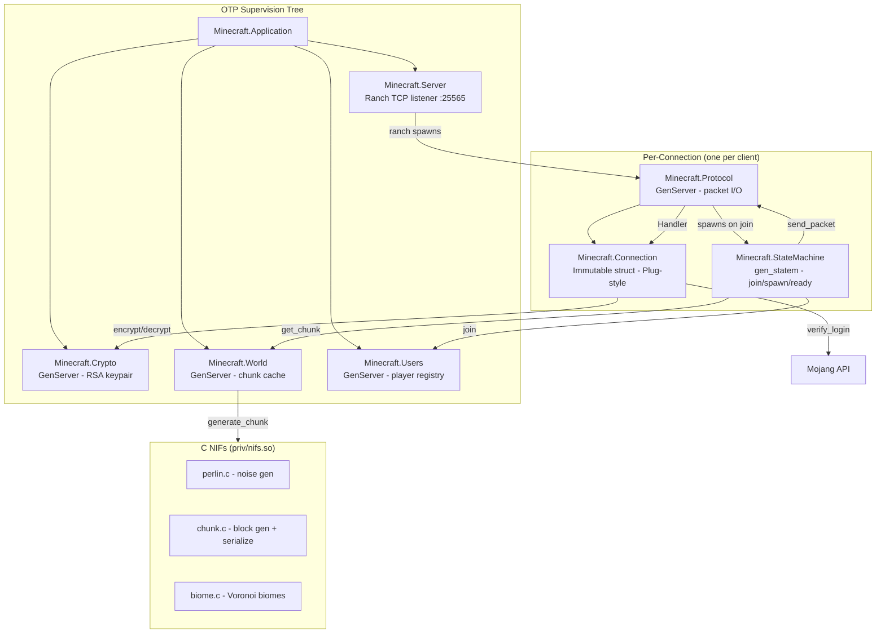
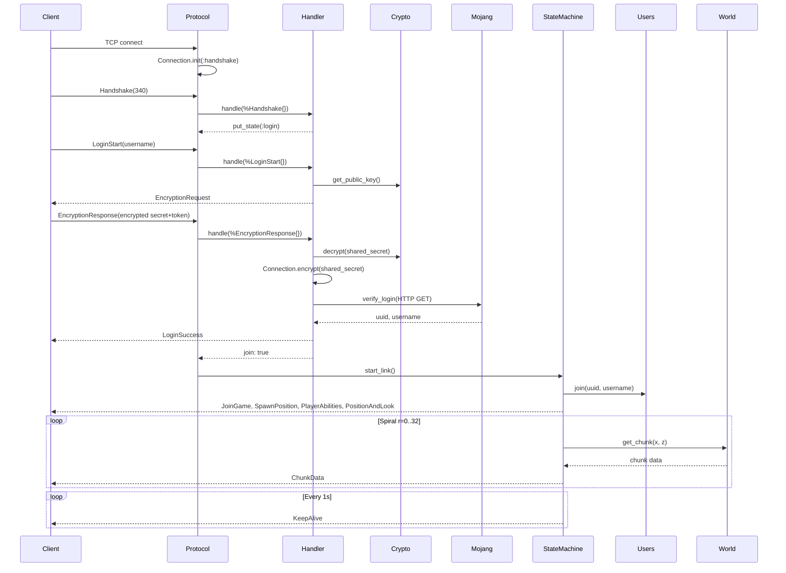

# Codebase Map

> Auto-generated by Cartographer. Last mapped: 2026-03-24

## System Overview

Minecraft 1.12.2 (Protocol 340) server implementation in Elixir with C NIFs for terrain generation.



## Directory Structure

```
minecraft/
├── lib/minecraft/
│   ├── application.ex          # OTP app entry point
│   ├── server.ex               # Ranch TCP listener
│   ├── protocol.ex             # Per-connection GenServer (packet I/O)
│   ├── protocol/handler.ex     # Stateless packet dispatch
│   ├── connection.ex           # Plug-style connection struct
│   ├── packet.ex               # Binary codec (VarInt, framing, dispatch table)
│   ├── state_machine.ex        # gen_statem: join -> spawn -> ready
│   ├── users.ex                # Player registry GenServer
│   ├── world.ex                # Chunk cache GenServer
│   ├── chunk.ex                # Elixir wrapper for NIF chunk resources
│   ├── crypto.ex               # RSA keypair GenServer (shells out to openssl)
│   ├── crypto/aes.ex           # AES-CFB8 stream cipher
│   ├── crypto/sha.ex           # Minecraft's non-standard SHA-1 hex digest
│   ├── nif.ex                  # NIF function stubs
│   └── packet/
│       ├── client/             # Client->server packet definitions
│       │   ├── handshake.ex
│       │   ├── login/          # LoginStart, EncryptionResponse
│       │   ├── play/           # Movement, settings, keepalive, etc.
│       │   └── status/         # Ping, Request
│       └── server/             # Server->client packet definitions
│           ├── login/          # EncryptionRequest, LoginSuccess
│           ├── play/           # JoinGame, ChunkData, SpawnPosition, etc.
│           └── status/         # Pong, Response
├── src/                        # C NIF source
│   ├── nifs.c                  # NIF entry point, resource types
│   ├── chunk.c/.h              # Block generation + chunk serialization
│   ├── biome.c/.h              # Voronoi biome placement
│   └── perlin.c/.h             # 3D Perlin noise with octaves
├── test/
│   ├── minecraft/
│   │   ├── packet_test.exs     # Packet serialization round-trips
│   │   ├── crypto_test.exs     # Crypto module tests
│   │   ├── crypto/sha_test.exs # Minecraft SHA-1 digest tests
│   │   ├── nif_test.exs        # NIF function tests
│   │   ├── world_test.exs      # World generation tests
│   │   └── integration/        # Full login flow integration test
│   └── support/test_client.ex  # TCP test client helper
├── config/config.exs           # (effectively empty)
├── mix.exs                     # Elixir ~> 1.6, Ranch 2.1, HTTPoison, Poison
└── Makefile                    # Compiles C NIFs into priv/nifs.so
```

## Module Guide

### Core: Connection Lifecycle

| File | Purpose | Tokens |
|------|---------|--------|
| `lib/minecraft/application.ex` | OTP app entry, supervision tree | 86 |
| `lib/minecraft/server.ex` | Ranch TCP listener on :25565 | 301 |
| `lib/minecraft/protocol.ex` | Per-connection GenServer, packet I/O | 731 |
| `lib/minecraft/connection.ex` | Plug-style immutable connection struct | 1995 |
| `lib/minecraft/protocol/handler.ex` | Stateless packet dispatch by struct type | 1107 |
| `lib/minecraft/state_machine.ex` | gen_statem: join/spawn/ready phases | 769 |

### Core: Game State

| File | Purpose | Tokens |
|------|---------|--------|
| `lib/minecraft/users.ex` | Player registry (uuid -> User struct) | 823 |
| `lib/minecraft/world.ex` | Chunk cache, delegates to NIF for generation | 577 |
| `lib/minecraft/chunk.ex` | Elixir wrapper for NIF chunk resources | 213 |

### Core: Crypto

| File | Purpose | Tokens |
|------|---------|--------|
| `lib/minecraft/crypto.ex` | RSA keypair GenServer (openssl CLI) | 887 |
| `lib/minecraft/crypto/aes.ex` | AES-CFB8 byte-by-byte stream cipher | 478 |
| `lib/minecraft/crypto/sha.ex` | Minecraft's signed SHA-1 hex digest | 151 |

### Core: Binary Protocol

| File | Purpose | Tokens |
|------|---------|--------|
| `lib/minecraft/packet.ex` | VarInt/String/Position codec + dispatch table | 2369 |
| `lib/minecraft/nif.ex` | Erlang NIF function stubs | 574 |

### C NIFs (Terrain Generation)

| File | Purpose | Tokens |
|------|---------|--------|
| `src/nifs.c` | NIF entry, resource type registration | 1614 |
| `src/chunk.c` | Block generation + 13-bit direct palette serialization | 1819 |
| `src/biome.c` | Voronoi biome placement (9 biome types) | 788 |
| `src/perlin.c` | 3D Perlin noise with octave support | 1124 |

## Data Flow: Login Sequence



## Conventions

- **Packet modules**: Each has a struct, `serialize/1` -> `{id, binary}`, `deserialize/1` -> `{struct, rest}`
- **Connection transforms**: Plug-style chainable functions taking and returning `%Connection{}`
- **Active-once flow control**: Socket set to `active: :once` after processing each message
- **State machine**: Connection states `:handshake -> :status | :login -> :play`
- **NIF resources**: C-allocated chunks managed by BEAM GC via resource types

## Gotchas

- `verify_login/1` makes a **blocking HTTP call** to Mojang inside the Protocol GenServer
- AES uses deprecated `:crypto.block_encrypt` (breaks on OTP 24+)
- `openssl` CLI must be in PATH for RSA key generation
- NIF loads from relative path `./priv/nifs` (fragile outside Mix)
- NIF chunk generation runs on scheduler thread (no dirty scheduler flags)
- StateMachine sends ~3200 chunks **synchronously** during `:spawn` state
- Users are never removed from the registry (no disconnect handler)
- KeepAlive responses from clients are never validated
- TeleportConfirm IDs are never validated against sent values
- World chunk cache grows unboundedly in memory

## Navigation Guide

**To add a new client packet**: Create module in `lib/minecraft/packet/client/{state}/`, add `deserialize` clause in `lib/minecraft/packet.ex`, add `handle` clause in `lib/minecraft/protocol/handler.ex`

**To add a new server packet**: Create module in `lib/minecraft/packet/server/{state}/`, add serialize support. Send via `Connection.send_packet/2` or `Protocol.send_packet/2`

**To modify terrain generation**: Edit C files in `src/`, recompile with `make`

**To add game logic on join**: Modify `lib/minecraft/state_machine.ex` states

**To modify authentication**: Edit `lib/minecraft/connection.ex` (`verify_login/1`) and `lib/minecraft/protocol/handler.ex` (EncryptionResponse handler)

**To add player interactions**: Extend `lib/minecraft/users.ex` and add corresponding packet handlers
