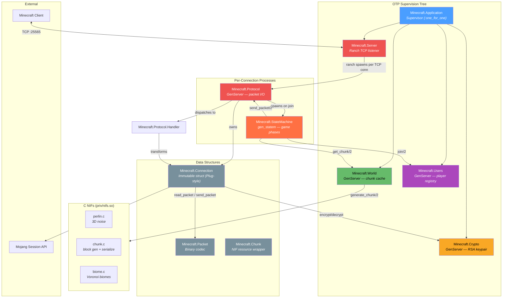
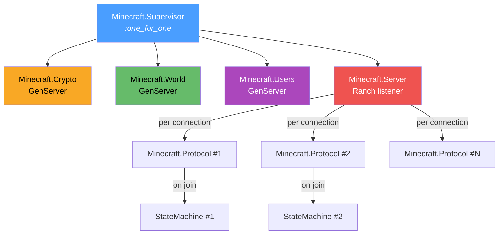
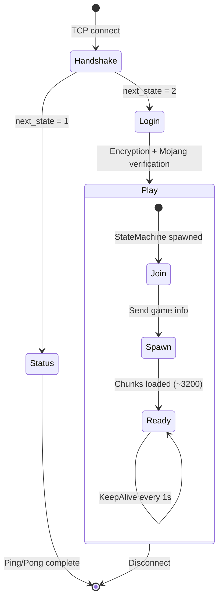
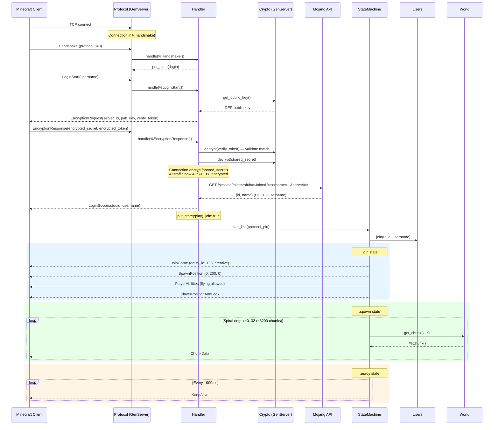
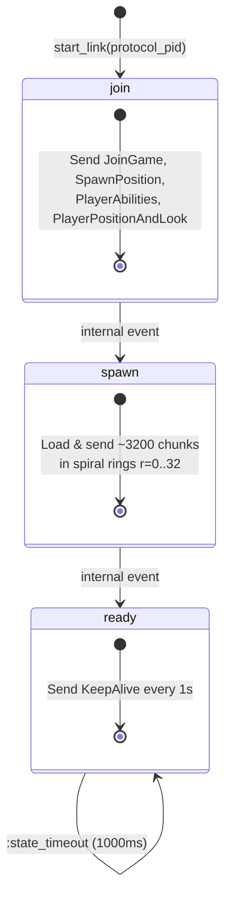
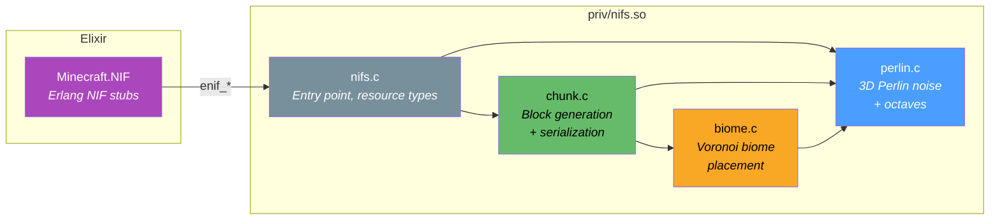

# Minecraft Server — Module Documentation

> A Minecraft 1.12.2 (Protocol 340) server written in Elixir with C NIFs for terrain generation.
>
> Protocol reference: [wiki.vg/Protocol](http://wiki.vg/Protocol)

---

## Table of Contents

- [Architecture Overview](#architecture-overview)
- [Supervision Tree](#supervision-tree)
- [Connection Lifecycle](#connection-lifecycle)
- [Module Reference](#module-reference)
  - [Minecraft.Application](#minecraftapplication)
  - [Minecraft.Server](#minecraftserver)
  - [Minecraft.Protocol](#minecraftprotocol)
  - [Minecraft.Connection](#minecraftconnection)
  - [Minecraft.Protocol.Handler](#minecraftprotocolhandler)
  - [Minecraft.StateMachine](#minecraftstatemachine)
  - [Minecraft.Users](#minecraftusers)
  - [Minecraft.World](#minecraftworld)
  - [Minecraft.Chunk](#minecraftchunk)
  - [Minecraft.Packet](#minecraftpacket)
  - [Minecraft.Crypto](#minecraftcrypto)
  - [Minecraft.Crypto.AES](#minecraftcryptoaes)
  - [Minecraft.Crypto.SHA](#minecraftcryptosha)
  - [Minecraft.NIF](#minecraftnif)
- [Packet Reference](#packet-reference)
  - [Client Packets](#client-packets-client--server)
  - [Server Packets](#server-packets-server--client)
  - [Packet ID Routing Table](#packet-id-routing-table)
- [C NIF Layer](#c-nif-layer)
- [Configuration & Build](#configuration--build)
- [Known Limitations](#known-limitations)

---

## Architecture Overview



---

## Supervision Tree

The application starts a `:one_for_one` supervisor. Child order matters — `Crypto`, `World`, and `Users` must be ready before `Server` accepts connections.



---

## Connection Lifecycle

A client connection goes through four protocol states:



### Full Login Sequence



---

## Module Reference

---

### `Minecraft.Application`

**File:** `lib/minecraft/application.ex`

OTP Application entry point. Starts the supervision tree.

```elixir
use Application

@impl true
def start(_type, _args)
```

**Children started (in order):**

| # | Child | Role |
|---|-------|------|
| 1 | `Minecraft.Crypto` | RSA keypair generation |
| 2 | `Minecraft.World` | Chunk cache + terrain generation |
| 3 | `Minecraft.Users` | Player registry |
| 4 | `Minecraft.Server` | TCP listener (Ranch) |

**Usage:** Started automatically by the OTP runtime. Configured in `mix.exs`:

```elixir
def application do
  [extra_applications: [:logger], mod: {Minecraft.Application, []}]
end
```

---

### `Minecraft.Server`

**File:** `lib/minecraft/server.ex`

Registers a Ranch TCP listener on port 25565.

#### Types

```elixir
@type server_opt :: {:max_connections, non_neg_integer()} | {:port, 0..65535}
@type server_opts :: [server_opt]
```

#### Functions

| Function | Spec | Description |
|----------|------|-------------|
| `child_spec/1` | `(server_opts) :: Supervisor.child_spec()` | Returns a supervisor child spec |
| `start_link/1` | `(server_opts) :: {:ok, pid} \| {:error, term}` | Starts the Ranch listener |

#### Options

| Option | Default | Description |
|--------|---------|-------------|
| `:port` | `25565` | TCP port to listen on |
| `:max_connections` | `100` | Maximum concurrent connections |

#### Example

```elixir
# Default options (port 25565, 100 max connections)
Minecraft.Server.start_link([])

# Custom port
Minecraft.Server.start_link(port: 25566, max_connections: 50)
```

---

### `Minecraft.Protocol`

**File:** `lib/minecraft/protocol.ex`

Per-connection GenServer spawned by Ranch for each TCP connection. Owns the socket, manages the `Connection` struct, and dispatches packets to `Handler`.

#### Behaviours

`:ranch_protocol`, `GenServer`

#### Functions

| Function | Spec | Description |
|----------|------|-------------|
| `start_link/4` | `(ref, socket, transport, opts)` | Called by Ranch on accept |
| `send_packet/2` | `(pid, struct) :: :ok \| {:error, term}` | Send a packet to the client (synchronous) |
| `get_conn/1` | `(pid) :: Connection.t()` | Get the current connection state |

#### Flow Control

Uses `:active_once` mode — the socket delivers one TCP message at a time. After processing, `Connection.continue/1` re-enables the socket. This prevents mailbox flooding.

#### Internal Flow

```
{:tcp, socket, data}
  → Connection.put_data(conn, data)     # decrypt if needed, buffer
  → handle_conn(conn)                   # recursive loop:
      → Connection.read_packet(conn)    # Packet.deserialize
      → Handler.handle(packet, conn)    # dispatch by struct type
      → Connection.send_packet(conn, response)
      → handle_conn(conn)              # next packet in buffer
  → Connection.continue(conn)           # re-enable socket
```

---

### `Minecraft.Connection`

**File:** `lib/minecraft/connection.ex`

Immutable struct representing a client connection. Designed to be chained in a fashion similar to [Plug](https://hexdocs.pm/plug/).

#### Types

```elixir
@type state :: :handshake | :status | :login | :play
@type transport :: :ranch_tcp

@type t :: %Connection{
  protocol_handler: pid,
  assigns: %{atom => any} | nil,
  settings: %{atom => any} | nil,
  current_state: state,
  socket: port | nil,
  transport: transport | nil,
  client_ip: String.t(),
  data: binary | nil,
  error: any,
  protocol_version: integer | nil,
  secret: binary | nil,
  join: boolean,
  state_machine: pid | nil,
  encryptor: Crypto.AES.t() | nil,
  decryptor: Crypto.AES.t() | nil
}
```

#### Functions

| Function | Spec | Description |
|----------|------|-------------|
| `init/3` | `(pid, port, transport) :: t` | Create a new connection in `:handshake` state |
| `assign/3` | `(t, atom, term) :: t` | Set a value in `conn.assigns` |
| `put_state/2` | `(t, state) :: t` | Transition protocol state |
| `put_data/2` | `(t, binary) :: t` | Buffer incoming data (decrypts if encrypted) |
| `put_error/2` | `(t, any) :: t` | Set error on connection |
| `put_protocol/2` | `(t, integer) :: t` | Set protocol version |
| `put_socket/2` | `(t, port) :: t` | Set socket |
| `put_setting/3` | `(t, atom, any) :: t` | Store a client setting |
| `read_packet/1` | `(t) :: {:ok, struct, t} \| {:error, t}` | Deserialize next packet from buffer |
| `send_packet/2` | `(t, struct) :: t \| {:error, :closed}` | Serialize and send a packet (encrypts if active) |
| `encrypt/2` | `(t, binary) :: t` | Enable AES-CFB8 encryption with shared secret |
| `verify_login/1` | `(t) :: t \| {:error, :failed_login_verification}` | Verify with Mojang session API |
| `join/1` | `(t) :: t` | Set `join: true` flag |
| `continue/1` | `(t) :: t` | Re-enable socket with `:active_once` |
| `close/1` | `(t) :: t` | Close the TCP socket |

#### Example — Plug-Style Chaining

```elixir
conn
|> Connection.assign(:username, "Steve")
|> Connection.put_state(:login)
|> Connection.put_protocol(340)
```

---

### `Minecraft.Protocol.Handler`

**File:** `lib/minecraft/protocol/handler.ex`

Stateless packet dispatcher. Pattern-matches on packet struct type and returns either a response packet or `:noreply`.

#### Functions

```elixir
@spec handle(Packet.packet_types(), Connection.t()) ::
  {:ok, :noreply | struct, Connection.t()}
  | {:error, :unsupported_protocol, Connection.t()}
```

#### Dispatch Table

| Incoming Packet | Action | Response |
|-----------------|--------|----------|
| `%Handshake{protocol_version: 340}` | Set state + protocol version | `:noreply` |
| `%Handshake{protocol_version: _}` | Error | `{:error, :unsupported_protocol}` |
| `%Status.Request{}` | Build JSON status | `%Status.Response{}` |
| `%Status.Ping{payload}` | Echo payload | `%Status.Pong{payload}` |
| `%Login.LoginStart{username}` | Assign username, generate verify token | `%EncryptionRequest{}` |
| `%Login.EncryptionResponse{}` | Decrypt, encrypt, verify with Mojang | `%LoginSuccess{}` |
| `%Play.ClientSettings{}` | Store 6 settings | `:noreply` |
| `%Play.PluginMessage{}` | Ignore | `:noreply` |
| `%Play.TeleportConfirm{}` | Ignore (TODO: validate) | `:noreply` |
| `%Play.PlayerPosition{}` | `Users.update_position/2` | `:noreply` |
| `%Play.PlayerPositionAndLook{}` | Update position + look | `:noreply` |
| `%Play.PlayerLook{}` | `Users.update_look/2` | `:noreply` |
| `%Play.ClientStatus{}` | Ignore (TODO: stats) | `:noreply` |
| `%Play.KeepAlive{}` | Ignore (TODO: timeout kick) | `:noreply` |
| `nil` | Unknown packet — ignore | `:noreply` |
| `{:error, _}` | Parse error — ignore | `:noreply` |

---

### `Minecraft.StateMachine`

**File:** `lib/minecraft/state_machine.ex`

Per-player `gen_statem` that sequences the game join flow. Spawned by `Protocol` when a player completes login.

#### Functions

```elixir
@spec start_link(protocol :: pid) :: :gen_statem.start_ret()
```

#### State Diagram



#### Join Phase Packets

| Order | Packet | Key Values |
|-------|--------|------------|
| 1 | `JoinGame` | entity_id: 123, game_mode: `:creative`, dimension: `:overworld`, difficulty: `:peaceful` |
| 2 | `SpawnPosition` | {0, 200, 0} |
| 3 | `PlayerAbilities` | creative, allow_flying, flying_speed: 0.1, fov_modifier: 0.2 |
| 4 | `PlayerPositionAndLook` | x: 0, y: 200, z: 0, teleport_id: random 1..127 |

#### Spawn Phase

Sends chunks in expanding circular rings from radius 0 to 32. For each radius `r`, iterates all (x, z) pairs where `x^2 + z^2` falls within the ring boundary. Approximately 3,200 chunks total.

---

### `Minecraft.Users`

**File:** `lib/minecraft/users.ex`

GenServer that stores the player registry. Maps UUIDs to `User` structs and tracks who is logged in.

#### Types

```elixir
# User struct
%Minecraft.Users.User{
  uuid: binary,
  username: binary,
  position: {float, float, float},     # default: {0.0, 0.0, 0.0}
  look: {float, float},                # default: {0.0, 0.0}  → {yaw, pitch}
  respawn_location: {float, float, float}  # default: {0.0, 0.0, 0.0}
}

# Internal state
%Minecraft.Users.State{
  users: %{binary => User.t()},   # uuid => User
  logged_in: MapSet.t()           # set of uuids
}
```

#### Functions

| Function | Spec | Description |
|----------|------|-------------|
| `start_link/1` | `(Keyword.t()) :: GenServer.on_start()` | Start the registry |
| `join/2` | `(binary, binary) :: :ok` | Register or re-login a player (idempotent) |
| `get_by_uuid/1` | `(binary) :: User.t() \| nil` | Look up by UUID (synchronous call) |
| `get_by_username/1` | `(binary) :: User.t() \| nil` | Look up by name (linear scan) |
| `update_position/2` | `(binary, {float, float, float}) :: :ok` | Update xyz (async cast) |
| `update_look/2` | `(binary, {float, float}) :: :ok` | Update yaw/pitch (async cast) |

#### Usage

```elixir
# Register a player on login
Minecraft.Users.join("069a79f4-44e9-4726-a5be-fca90e38aaf5", "Notch")

# Look up a player
user = Minecraft.Users.get_by_uuid("069a79f4-44e9-4726-a5be-fca90e38aaf5")
# => %User{uuid: "069a...", username: "Notch", position: {0.0, 0.0, 0.0}, ...}

# Update position from client packet
Minecraft.Users.update_position("069a...", {100.5, 64.0, -200.3})
```

---

### `Minecraft.World`

**File:** `lib/minecraft/world.ex`

GenServer managing the chunk cache. Generates chunks on demand using C NIFs (Perlin noise + Voronoi biomes).

#### Types

```elixir
@type world_opts :: [{:seed, integer}]
```

#### Functions

| Function | Spec | Description |
|----------|------|-------------|
| `start_link/1` | `(world_opts) :: GenServer.on_start()` | Start the world (default seed: 1230) |
| `get_chunk/2` | `(integer, integer) :: Chunk.t()` | Get or generate a chunk at (x, z) |

#### State

```elixir
%{
  seed: integer,
  chunks: %{x :: integer => %{z :: integer => Chunk.t()}}
}
```

#### Initialization

On startup, the world:
1. Calls `NIF.set_random_seed(seed)` to initialize Perlin noise tables
2. Pre-loads a 41x41 spawn area (x: -20..20, z: -20..20 = 1,681 chunks)
3. Chunks are loaded asynchronously via `send(self(), {:load_chunk, x, z})`

#### Usage

```elixir
# Start with default seed
Minecraft.World.start_link([])

# Start with custom seed
Minecraft.World.start_link(seed: 42)

# Get a chunk (generates if not cached)
chunk = Minecraft.World.get_chunk(5, -3)
# => %Minecraft.Chunk{resource: #Reference<...>}
```

---

### `Minecraft.Chunk`

**File:** `lib/minecraft/chunk.ex`

Thin Elixir wrapper around a NIF-managed chunk resource (C-allocated `struct Chunk *`). Memory is managed by the BEAM garbage collector via NIF resource types.

#### Types

```elixir
@type t :: %Minecraft.Chunk{resource: binary}
```

#### Functions

| Function | Description |
|----------|-------------|
| `serialize/1` | Serialize chunk to Minecraft wire format (calls NIF) |
| `num_sections/1` | Number of 16-block-tall sections (min 4) |
| `get_biome_data/1` | 256-byte biome ID array for the chunk |

#### Inspect Protocol

```elixir
inspect(chunk)
# => "#Chunk<x=5, z=-3>"
```

---

### `Minecraft.Packet`

**File:** `lib/minecraft/packet.ex`

Core binary codec. Handles Minecraft's VarInt/VarLong wire format, packet framing (length-prefixed), and the dispatch table mapping `{state, packet_id, direction}` to packet modules.

#### Types

```elixir
@type position :: {x :: -33_554_432..33_554_431, y :: -2048..2047, z :: -33_554_432..33_554_431}
@type varint   :: -2_147_483_648..2_147_483_647
@type varlong  :: -9_223_372_036_854_775_808..9_223_372_036_854_775_807
@type packet_types :: Client.Handshake.t() | Client.Status.Request.t() | ...  # union of all packet structs
```

#### Wire Format

```
┌──────────────┬──────────────┬──────────────────┐
│ Length       │ Packet ID   │ Data             │
│ (VarInt)    │ (VarInt)    │ (binary)         │
└──────────────┴──────────────┴──────────────────┘
  Length = size(Packet ID) + size(Data)
```

#### Functions — Packet Framing

| Function | Spec | Description |
|----------|------|-------------|
| `deserialize/3` | `(binary, state, :client \| :server) :: {struct, rest} \| {:error, :invalid_packet}` | Decode a framed packet |
| `serialize/1` | `(struct) :: {:ok, binary}` | Encode a packet struct to framed binary |
| `serialize/2` | `(integer, binary) :: {:ok, binary}` | Encode raw packet_id + data to framed binary |

#### Functions — Primitive Codecs

| Function | Spec | Description |
|----------|------|-------------|
| `encode_varint/1` | `(varint) :: binary` | Encode a 32-bit variable-length integer |
| `decode_varint/1` | `(binary) :: {varint, rest}` | Decode a VarInt from binary |
| `encode_varlong/1` | — | Encode a 64-bit variable-length integer |
| `decode_varlong/1` | `(binary) :: {varlong, rest}` | Decode a VarLong from binary |
| `encode_string/1` | `(binary) :: binary` | VarInt-length-prefixed UTF-8 string |
| `decode_string/1` | `(binary) :: {binary, rest}` | Decode a length-prefixed string |
| `encode_bool/1` | `(boolean) :: binary` | `true` = `0x01`, `false` = `0x00` |
| `decode_bool/1` | `(binary) :: {boolean, rest}` | Decode a boolean byte |
| `encode_position/1` | `(position) :: binary` | Pack (x, y, z) into 64-bit integer |
| `decode_position/1` | `(binary) :: {position, rest}` | Unpack 64-bit position |

#### Usage

```elixir
# Encode a VarInt
Minecraft.Packet.encode_varint(300)
# => <<0xAC, 0x02>>

# Decode a VarInt
Minecraft.Packet.decode_varint(<<0xAC, 0x02, 0xFF>>)
# => {300, <<0xFF>>}

# Serialize a server packet
alias Minecraft.Packet.Server.Status.Pong
{:ok, binary} = Minecraft.Packet.serialize(%Pong{payload: 12345})

# Deserialize a client packet
{packet, rest} = Minecraft.Packet.deserialize(data, :handshake, :client)
# => {%Client.Handshake{protocol_version: 340, ...}, ""}
```

---

### `Minecraft.Crypto`

**File:** `lib/minecraft/crypto.ex`

GenServer that generates a 1024-bit RSA keypair at startup using the `openssl` CLI. Provides encrypt/decrypt operations for the login handshake.

#### Functions

| Function | Spec | Description |
|----------|------|-------------|
| `start_link/1` | `(Keyword.t()) :: GenServer.on_start()` | Generate keypair and start |
| `get_public_key/0` | `() :: binary` | DER-encoded SubjectPublicKeyInfo |
| `encrypt/1` | `(binary) :: binary` | RSA public-key encrypt |
| `decrypt/1` | `(binary) :: binary` | RSA private-key decrypt |

#### Key Generation

```
openssl genrsa 1024 > /tmp/xxxx/rsa_key
openssl rsa -in /tmp/xxxx/rsa_key -pubout > /tmp/xxxx/rsa_pub_key
```

Keys are stored in a temp directory and deleted on `terminate/2`.

#### Usage

```elixir
# Get the public key for EncryptionRequest
pub_key = Minecraft.Crypto.get_public_key()
# => <<48, 129, ...>> (DER binary)

# Decrypt client's shared secret
shared_secret = Minecraft.Crypto.decrypt(encrypted_secret)
```

> **Note:** Requires `openssl` in the system PATH.

---

### `Minecraft.Crypto.AES`

**File:** `lib/minecraft/crypto/aes.ex`

AES/CFB8 stream cipher for encrypting/decrypting Minecraft traffic after the login handshake.

#### Types

```elixir
@type t :: %Minecraft.Crypto.AES{key: binary, ivec: binary}
```

#### Functions

| Function | Spec | Description |
|----------|------|-------------|
| `encrypt/2` | `(binary, t) :: {encrypted :: binary, new_state :: t}` | Encrypt and advance IV |
| `decrypt/2` | `(binary, t) :: {decrypted :: binary, new_state :: t}` | Decrypt and advance IV |

#### How CFB8 Works

```
For each byte:
  1. AES-encrypt the 16-byte IV → get output block
  2. XOR the first byte of output with the plaintext byte → ciphertext byte
  3. Slide IV: drop first byte, append ciphertext byte
```

The shared secret from the login handshake is used as both the AES key and the initial IV.

#### Usage

```elixir
# Initialize after key exchange
state = %Minecraft.Crypto.AES{key: shared_secret, ivec: shared_secret}

# Encrypt outgoing data
{encrypted, new_state} = Minecraft.Crypto.AES.encrypt(plaintext, state)

# Decrypt incoming data
{decrypted, new_state} = Minecraft.Crypto.AES.decrypt(ciphertext, state)
```

---

### `Minecraft.Crypto.SHA`

**File:** `lib/minecraft/crypto/sha.ex`

Implements Minecraft's non-standard SHA-1 hex digest encoding used during login verification.

#### Functions

```elixir
@spec sha(binary) :: String.t()
```

#### Algorithm

1. Compute standard SHA-1 hash (160 bits)
2. Interpret as a **signed** 160-bit integer
3. If negative: prepend `"-"`, negate, then hex-encode
4. If positive: hex-encode directly
5. Always lowercase, **no zero-padding** (variable length)

#### Usage

```elixir
Minecraft.Crypto.SHA.sha("Notch")
# => "4ed1f46bbe04bc756bcb17c0c7ce3e4632f06a48"

Minecraft.Crypto.SHA.sha("simon")
# => "88e16a1019277b15d58faf0541e11910eb756f6"  (39 chars, not 40)

Minecraft.Crypto.SHA.sha("jeb_")
# => "-7c9d5b0044c130109a5d7b5fb5c317c02b4e28c1"  (negative!)
```

---

### `Minecraft.NIF`

**File:** `lib/minecraft/nif.ex`

Erlang NIF stubs for C-implemented chunk operations. Loaded from `priv/nifs.so` on module load.

#### Functions

| Function | Spec | Description |
|----------|------|-------------|
| `load_nifs/0` | `() :: :ok \| {:error, any}` | Load the NIF shared library |
| `set_random_seed/1` | `(integer) :: :ok` | Initialize Perlin noise permutation tables |
| `generate_chunk/2` | `(float, float) :: {:ok, resource}` | Generate a chunk at (x, z) |
| `serialize_chunk/1` | `(resource) :: {:ok, binary}` | Serialize chunk to Minecraft wire format |
| `get_chunk_coordinates/1` | `(resource) :: {:ok, {integer, integer}}` | Get chunk (x, z) coordinates |
| `num_chunk_sections/1` | `(resource) :: {:ok, integer}` | Count vertical sections |
| `chunk_biome_data/1` | `(resource) :: {:ok, binary}` | Get 256-byte biome ID array |

> **Note:** NIF functions run on BEAM scheduler threads (no dirty scheduler flags). Long-running chunk generation could temporarily block a scheduler.

---

## Packet Reference

Each packet module follows a convention:

```elixir
defmodule Minecraft.Packet.{Direction}.{State}.{Name} do
  @type t :: %__MODULE__{packet_id: integer, ...fields}
  defstruct [packet_id: 0xNN, ...fields]

  def serialize(%__MODULE__{} = packet) :: {packet_id, binary}
  def deserialize(binary) :: {%__MODULE__{}, rest}
end
```

### Client Packets (Client → Server)

| Module | ID | State | Fields |
|--------|----|-------|--------|
| `Client.Handshake` | `0x00` | handshake | `protocol_version`, `server_addr`, `server_port`, `next_state` |
| `Client.Status.Request` | `0x00` | status | *(empty)* |
| `Client.Status.Ping` | `0x01` | status | `payload` (int64) |
| `Client.Login.LoginStart` | `0x00` | login | `username` |
| `Client.Login.EncryptionResponse` | `0x01` | login | `shared_secret`, `verify_token` (RSA-encrypted) |
| `Client.Play.TeleportConfirm` | `0x00` | play | `teleport_id` (varint) |
| `Client.Play.ClientStatus` | `0x03` | play | `action` (`:perform_respawn` \| `:request_stats`) |
| `Client.Play.ClientSettings` | `0x04` | play | `locale`, `view_distance`, `chat_mode`, `chat_colors`, `displayed_skin_parts`, `main_hand` |
| `Client.Play.PluginMessage` | `0x09` | play | `channel`, `data` |
| `Client.Play.KeepAlive` | `0x0B` | play | `keep_alive_id` (int64) |
| `Client.Play.PlayerPosition` | `0x0D` | play | `x`, `y`, `z` (float64), `on_ground` |
| `Client.Play.PlayerPositionAndLook` | `0x0E` | play | `x`, `y`, `z` (float64), `yaw`, `pitch` (float32), `on_ground` |
| `Client.Play.PlayerLook` | `0x0F` | play | `yaw`, `pitch` (float32), `on_ground` |

### Server Packets (Server → Client)

| Module | ID | State | Fields |
|--------|----|-------|--------|
| `Server.Status.Response` | `0x00` | status | `json` (string — version, players, description) |
| `Server.Status.Pong` | `0x01` | status | `payload` (int64) |
| `Server.Login.EncryptionRequest` | `0x01` | login | `server_id`, `public_key`, `verify_token` |
| `Server.Login.LoginSuccess` | `0x02` | login | `uuid`, `username` |
| `Server.Play.JoinGame` | `0x23` | play | `entity_id`, `game_mode`, `dimension`, `difficulty`, `max_players`, `level_type`, `reduced_debug_info` |
| `Server.Play.SpawnPosition` | `0x46` | play | `position` (packed int64) |
| `Server.Play.PlayerAbilities` | `0x2C` | play | `flags`, `flying_speed`, `fov_modifier` |
| `Server.Play.PlayerPositionAndLook` | `0x2F` | play | `x`, `y`, `z`, `yaw`, `pitch`, `flags`, `teleport_id` |
| `Server.Play.KeepAlive` | `0x1F` | play | `keep_alive_id` (int64) |
| `Server.Play.ChunkData` | `0x20` | play | `chunk_x`, `chunk_z`, `ground_up_continuous`, `primary_bit_mask`, `chunk_data`, `biome_data`, `num_sections` |

### Packet ID Routing Table

```
                        ┌─────────────────────────────────────────────────┐
                        │          Packet.deserialize(data, state, dir)  │
                        └──────────────────────┬──────────────────────────┘
                                               │
                    ┌──────────────────────────┼──────────────────────────┐
                    │                          │                          │
              :handshake                    :status                    :login
                    │                     ┌────┴────┐                ┌────┴────┐
               0x00 Client          Client│         │Server    Client│         │Server
                Handshake         0x00 Request  0x00 Response  0x00 LoginStart 0x01 EncReq
                                  0x01 Ping     0x01 Pong      0x01 EncResp   0x02 LoginOK
                                                                              │
                                                                           :play
                                                               ┌────────────┴────────────┐
                                                          Client│                         │Server
                                                     0x00 TeleportConfirm          0x1F KeepAlive
                                                     0x03 ClientStatus             0x20 ChunkData
                                                     0x04 ClientSettings           0x23 JoinGame
                                                     0x09 PluginMessage            0x2C PlayerAbilities
                                                     0x0B KeepAlive                0x2F PosAndLook
                                                     0x0D PlayerPosition           0x46 SpawnPosition
                                                     0x0E PlayerPosAndLook
                                                     0x0F PlayerLook
```

---

## C NIF Layer

The terrain generation is implemented in C for performance. Four source files compile into `priv/nifs.so`.

### Module Diagram



### `nifs.c` — Entry Point

- Registers the `Chunk` NIF resource type with a destructor
- Binds 6 C functions to Erlang-callable names
- `chunk_res_destructor` frees heightmap, biome data, and all chunk sections

### `perlin.c` — Terrain Height

- 3D Perlin noise with configurable octaves
- Base frequency: 0.02, persistence: 0.4
- Height generation uses a fixed `y = 28.237` (effectively 2D)
- Global permutation table `p[512]` — initialized by `set_random_seed`

### `chunk.c` — Block Generation

- Generates 16x256x16 block columns
- Block types: bedrock, stone, dirt/sand, grass/sand, water (y < 64), tall grass, dandelion
- Serialization: 13 bits-per-block direct palette (global block state IDs)
- Sky light = 0xF, block light = 0x0

### `biome.c` — Biome Placement

- Voronoi-based: world divided into 640-block zones
- 0-9 biome seeds per zone, nearest-seed determines biome
- 9 biome types: Ocean, Plains, Desert, Forest, Taiga, Swamp, Ice Plains, Jungle, Savanna

---

## Configuration & Build

### Dependencies

| Package | Version | Purpose |
|---------|---------|---------|
| `ranch` | `~> 2.1` | TCP connection pooling |
| `httpoison` | `~> 1.2` | HTTP client (Mojang API) |
| `poison` | `~> 5.0` | JSON codec |
| `mock` | `~> 0.3.0` | Test mocking (test only) |
| `excoveralls` | `~> 0.8` | Code coverage (test only) |
| `ex_doc` | `~> 0.16` | Documentation (dev only) |

### Building

```bash
# Install Elixir dependencies
mix deps.get

# Compile (includes C NIFs via custom :nifs compiler)
mix compile

# Run the server
iex -S mix
```

### NIF Compilation

The custom Mix compiler (`:nifs`) runs `make`, which compiles:

```bash
cc -Wall -Wextra -Wpedantic -O3 -fPIC -shared -std=c99 \
   -I $(erl -eval '...') \
   src/nifs.c src/perlin.c src/chunk.c src/biome.c \
   -o priv/nifs.so
```

### Running

```bash
# Start in interactive mode
iex -S mix

# The server listens on port 25565
# Connect with a Minecraft 1.12.2 client
```

---

## Known Limitations

| Area | Limitation |
|------|------------|
| **Authentication** | `verify_login/1` makes a blocking HTTP call inside the GenServer |
| **Encryption** | Uses deprecated `:crypto.block_encrypt` (may break on OTP 24+) |
| **RSA** | 1024-bit key (weak) — matches Minecraft protocol spec |
| **Chunk loading** | ~3200 chunks sent synchronously during `:spawn` (blocks StateMachine) |
| **World storage** | In-memory only, no persistence, unbounded growth |
| **Player tracking** | Users never removed from registry (no disconnect handler) |
| **KeepAlive** | Client responses never validated, no timeout kick |
| **TeleportConfirm** | Teleport IDs never validated |
| **NIF scheduling** | Chunk generation runs on BEAM scheduler (no dirty flags) |
| **NIF path** | Loads from `./priv/nifs` (relative to CWD, fragile in releases) |
| **System dep** | `openssl` CLI must be in PATH |
| **Protocol** | Only Minecraft 1.12.2 (protocol 340) supported |
| **Missing packets** | No Disconnect, Set Compression, Window Items, Chat, Entity packets |
| **Multiplayer** | No player-to-player visibility, chat, or interaction |
